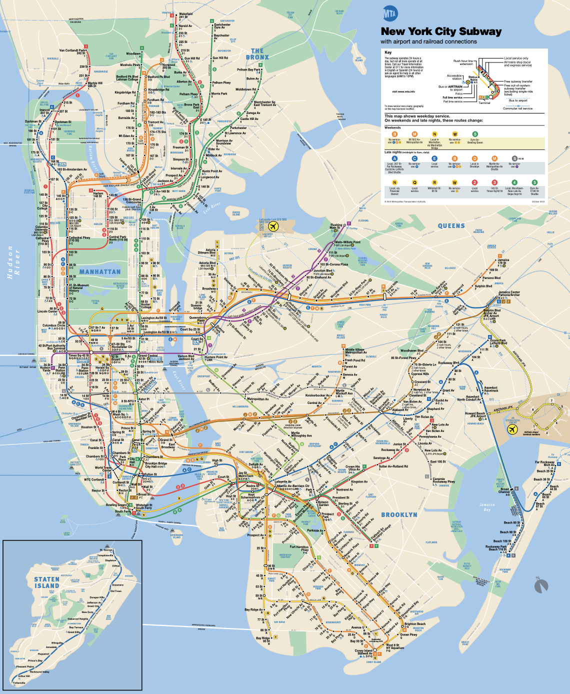

# Results

```{r}
library(tidyverse)
library(ggthemes)
library(ggmosaic)
library(choroplethr)
library(choroplethrZip)
library(gridExtra)

load("data/travel_data.rda")
load("data/mobility_general.rda") 
load("data/tidy_survey_data.rda")  
weight <- read.csv("data/weight.csv")
weight1 <- read.csv("data/weight_fill.csv")
```


## Differences between gender composition of the residents choosing different transportation modes

Calculate the proportion of the respondents with different gender. There are totally 41.12% males and 58.77% females among all the respondents.

```{r}
traveler_gender <- df_general[c(1:2, 31)]

traveler_gender['gender'] <- factor(traveler_gender$qgender)

traveler_gender %>%
  group_by(gender) %>%
  summarise(num = sum(allwt)) %>%
  ungroup() %>%
  mutate(prop = num / sum(num)) %>% 
  ggplot(aes(reorder(gender, -prop), prop)) +
  geom_col() +
  scale_x_discrete(labels=c("1" = "Male", "2" = "Female", 
                            "3" = "Don't know", "4" = "Refused")) + 
  scale_y_continuous(labels = scales::percent) +
  labs(x = 'Gender', y = 'Proportion', 
       title = "Proportion of Male and Female Respondents", 
       caption = "Source: https://data.cityofnewyork.us/Transportation/Citywide-Mobility-Survey-Main-Survey/dd6w-hnq9") +
  theme_economist()+
  theme(axis.text.x = element_text(size = 8, angle = 0))
```

After removing the records which are "Don't know" or "Refused" in Gender, we plot a stacked bar chart and use the proportion of each gender we calculated above as the basis for comparison. Note that if there's no difference between the gender composition of each transportation mode, then the line separates male and female should be on the same level. 

We can easily notice that the gender composition among different modes are different, especially between bicycle and the other modes. Almost 70% residents that prefer riding a bicycle to get around the city are males, greatly beyond the number of females. On the contrary, relative less males than females would like to choose bus, for-hire vehicle and walk, which is not due to the unbalanced sampling proportion of different gender.

In order to interpret the huge difference between the number of males and females preferring bicycle, we propose several possible reasons firstly. It may be because females do not think riding bicycle is safe enough in New York City due to the high crime rate, or males want to make use of their spare time to take exercise, for which riding bicycle is a good idea. We can further verify our guesses by exploring the question in the questionnaire, "Which of the following words most apply to Bicycling?".   

```{r, echo=FALSE}
# Transportation mode ~ Gender
traveler_gender1 <- traveler_gender[c(1, 4)] %>%
  filter(gender %in% c(1, 2))
travel_mode <- df_travel[c(1, 5:12)]

traveler_gender1$Gender[traveler_gender1$gender == 1] <- "Male"
traveler_gender1$Gender[traveler_gender1$gender == 2] <- "Female"
traveler_gender1 <- subset(traveler_gender1, select = c(1, 3))

df1 <- merge(travel_mode, traveler_gender1, by = "UniqueID", all.y = TRUE) %>%
  gather(key = 'Mode', value = "Number", -c(1, 10)) %>%
  merge(weight1, by = "UniqueID", all = TRUE) %>%
  mutate(Count = weight_fill * Number) %>%
  group_by(Mode, Gender) %>%
  summarise(Sum = sum(Count)) %>%
  ungroup() %>%
  group_by(Mode) %>%
  mutate(Prop = Sum/sum(Sum), Order = last(Prop)) %>%
  ungroup()

ggplot(df1, aes(reorder(Mode, -Order), Sum, fill = Gender)) +
  geom_bar(stat="identity", position = "fill") + 
  scale_y_continuous(labels = scales::percent) +
  labs(x = 'Transportation Mode', y = 'Proportion', 
       title = "Gender Composition", 
       caption = "Source: https://data.cityofnewyork.us/Transportation/Citywide-Mobility-Survey-Main-Survey/dd6w-hnq9") +
  theme_economist() +
  scale_fill_manual(values=c("#acc8d4", "#4a4a4a")) +
  theme(axis.text.x = element_text(size = 8, angle = 0), 
        legend.position = "right", 
        legend.title = element_blank(),
        legend.text = element_text(size = 9),
        legend.key.size = unit(0.6, "cm"))
```

Visualize respondents' description of bicycling via Cleveland dot plot faceted by gender. We separate respondents into two groups, preferring bicycling and not preferring bicycling. For those would like to ride a bicycle to get around the city, both females and males, the majority of them think bicycling is not only inexpensive but also convenient. However, for those not preferring bicycling, the main reason for they rejecting to ride a bicycling to get around the city is that they think it's not safe enough in New York City. By further exploring, we notice that the order of the reasons for preferring or not preferring riding a bicycle are the same for male and female residents, but the gender composition in Bicycling shows that more males than females chose this mode. The possible interpretation is that what males are concerned about most is different from that of females. Comparing safety with cost as well as comfort level, males value the latter more. On the contrary, females may be concerned about safety most, which is consistent with our guess.

```{r}
survey <- read.csv("data/raw_survey_data.csv")

Survey <- survey %>%
  filter(!is.na(qgender) & qgender %in% c(1, 2)) %>%
  subset(select = c("UniqueID", "qgender", "gFOCUSAA1_qFOCUSAA6_mA1",
                    "gFOCUSAA1_qFOCUSAA6_mA2", "gFOCUSAA1_qFOCUSAA6_mA3", 
                    "gFOCUSAA1_qFOCUSAA6_mA4", "gFOCUSAA1_qFOCUSAA6_mA5", 
                    "gFOCUSAA1_qFOCUSAA6_mA6", "gFOCUSAA1_qFOCUSAA6_mA7", 
                    "gFOCUSAA1_qFOCUSAA6_mA8", "allwt"))

colnames(Survey) <- c("UniqueID", "Gender", "Convenient", "Reliable", 
                      "Fast", "Inexpensive", "Safe", "Comfortable",
                      "Don't know", "Refused", "allwt")

Survey$Gender[Survey$Gender == '1'] <- "Male"
Survey$Gender[Survey$Gender == '2'] <- "Female"

survey_1 <- merge(travel_mode, Survey, by = "UniqueID", all.y = TRUE) %>%
  filter(Bicycle == 0) %>%  # Only forcus on those did not choose bicycle
  subset(select = c(1, 10:19)) %>%
  gather(key = "Description", value = "Choice", -c(1:2, 11)) %>%
  group_by(Description, Gender, Choice) %>%
  summarise(Num = sum(allwt)) %>%
  ungroup() %>%
  group_by(Description, Gender) %>%
  mutate(Prop = Num / sum(Num), Order = first(Prop)) %>%
  ungroup()
  
# Description of Bicycling from Residents Who Do Not Prefer Bicycling
ggplot(survey_1, aes(x = Prop, y = reorder(Description, -Order), color = factor(Choice))) +
  geom_point(size = 1.8) +
  facet_grid(Gender~.) +
  scale_x_continuous(labels = scales::percent) +
  labs(x = "Proportion", y = "Description", 
       title = "Description of Bicycling from Residents Who Do Not Prefer Bicycling",
       caption = "Source: https://data.cityofnewyork.us/Transportation/Citywide-Mobility-Survey-Main-Survey/dd6w-hnq9") + 
  scale_color_manual(labels = c("No", "Yes"), 
                     values = c("gray40", "sienna3"))+
  theme_economist() +
  theme(axis.text.x = element_text(size = 8, angle = 0), 
        plot.title = element_text(size = 12), 
        legend.position = "bottom", 
        legend.title = element_blank(),
        legend.text = element_text(size = 9))
```

```{r}
survey_2 <- merge(travel_mode, Survey, by = "UniqueID", all.y = TRUE) %>%
  filter(Bicycle == 1) %>%  # Only forcus on those did not choose bicycle
  subset(select = c(1, 10:19)) %>%
  gather(key = "Description", value = "Choice", -c(1:2, 11)) %>%
  group_by(Description, Gender, Choice) %>%
  summarise(Num = sum(allwt)) %>%
  ungroup() %>%
  group_by(Description, Gender) %>%
  mutate(Prop = Num / sum(Num), Order = first(Prop)) %>%
  ungroup()

# Description of Bicycling from Residents Who Prefer Bicycling
ggplot(survey_2, aes(x = Prop, y = reorder(Description, -Order), 
                     color = factor(Choice))) +
  geom_point(size = 1.8) +
  facet_grid(Gender~.) +
  scale_x_continuous(labels = scales::percent) +
  labs(x = "Proportion", y = "Description", 
       title = "Description of Bicycling from Residents Who Prefer Bicycling",
       caption = "Source: https://data.cityofnewyork.us/Transportation/Citywide-Mobility-Survey-Main-Survey/dd6w-hnq9") + 
  scale_color_manual(labels = c("No", "Yes"), 
                     values = c("gray40", "sienna3"))+
  theme_economist() +
  theme(axis.text.x = element_text(size = 8, angle = 0), 
        plot.title = element_text(size = 13), 
        legend.position = "bottom", 
        legend.title = element_blank(),
        legend.text = element_text(size = 9))
```

There's a question in the questionnaire which is "How important is it to you that making it safer and easier to bike by adding bike lanes". This helps us decide one aspect which people think causes the danger of riding bicycle in New York City. We plot it into a diverted bar chart. It shows that both males and females think adding bike lanes are really important, although with different degree. This indicates that the current number of bike lanes in NYC are still not enough and car accident may negatively influence the proportion of residents who would like to ride a bicycle to get around the city.

```{r}
important <- df_general[c(1, 2, 22, 31)] 
colnames(important) <- c("UniqueID", "Gender", "Importance", "allwt")
important <- important %>% 
  mutate(Importance = recode(Importance, `1` = "Extremely important", 
                       `2` = "Very important",
                       `3` = "Somewhat important",
                       `4` = "Not very important", 
                       `5` = "Not at all important",
                       `6` = "Don’t know", 
                       `7` = "Refused", 
                       `99` = "Redused")) %>%
  spread(key = Importance, value = allwt) %>%
  mutate_at(c(3:9), ~replace(., is.na(.), 0)) %>%
  group_by(Gender) %>%
  summarise(`Extremely important` = sum(`Extremely important`), 
            `Very important` = sum(`Very important`),
            `Somewhat important` = sum(`Somewhat important`),
            `Not very important` = sum(`Not very important`),
            `Not at all important` = sum(`Not at all important`),
            `Refused` = sum(`Refused`)) %>%
  filter(Gender %in% c(1, 2)) %>%
  mutate(Gender = recode(Gender, `1` = "Male",
                         `2` = "Female")) %>%
  mutate(Sum = `Extremely important` + `Very important` + `Somewhat important`
         + `Not very important` + `Not at all important` + `Refused`) %>%
  mutate(`Extremely important` = 100 * `Extremely important` / Sum,
         `Very important` = 100 * `Very important` / Sum,
         `Somewhat important` = 100 * `Somewhat important` / Sum,
         `Not very important` = 100 * `Not very important` / Sum,
         `Not at all important` = 100 * `Not at all important` / Sum,
         `Refused` = 100 * `Refused` / Sum) %>%
  subset(select = c(1:7))

important <- important[, c(6, 5, 7, 4, 3, 2, 1)]

HH::likert(Gender ~ ., 
           data = important,
           positive.order = TRUE,
           xlab = list(label = "Gender"),
           ylab = list(label = "Respondents%"),
           main = 'How Important Is It to You That Making It Safer and \n Easier to Bike by Adding Bike Lanes',
           scales = list(cex = 1),
           auto.key.in = list(cex = 0.8),
           horizontal = FALSE) 
```


## Differences between income composition of the residents choosing different transportation modes

We are also interested in the possible relationship between resident's income and their mode choices. First we plot a bar chart in terms of income to quick learn about the proportion of respondents with different income. According to our interest, we recombine the income into 4 categories, which are "\$100,000 and above", "\$25,000 - \$99,999", "Less than \$24,999" and "Other". Almost half of the respondents have a year's income between $25,000 and \$99,999 and the proportions of residents with less than \$24,999 income and those with more than \$100,000 income are roughly equal.

```{r}
traveler_income <- df_general[c(1, 6, 31)]
traveler_income$qincome[traveler_income$qincome %in% c(1, 2)] <- "Less than $24,999"
traveler_income$qincome[traveler_income$qincome %in% c(3, 4, 5, 6)] <- "$25,000 - $99,999"
traveler_income$qincome[traveler_income$qincome %in% c(7, 8, 9)] <- "$100,000 and above"
traveler_income$qincome[traveler_income$qincome %in% c(10, 11)] <- "Other"

traveler_income['qincome'] <- 
  factor(traveler_income$qincome,
         levels = c("$100,000 and above", 
                    "$25,000 - $99,999", 
                    "Less than $24,999", 
                    "Other"))

traveler_income %>%
  group_by(qincome) %>%
  summarise(num = sum(allwt)) %>%
  ungroup() %>%
  mutate(prop = num / sum(num)) %>% 
  ggplot(aes(qincome, prop)) +
  geom_col() +
  scale_y_continuous(labels = scales::percent) +
  labs(x = 'Income', y = 'Proportion', 
       title = "Proportion of Respondents with Different Income", 
       caption = "Source: https://data.cityofnewyork.us/Transportation/Citywide-Mobility-Survey-Main-Survey/dd6w-hnq9") +
  theme_economist()+
  theme(axis.text.x = element_text(size = 8, angle = 0))
```

Then we plot a stacked bar chart to compare the income composition between different modes. The most obvious differences include 1) the residents whose income higher than \$100,000 prefer bicycling and car more than other transportation modes and the proportions of these two choices are roughly equal, 2) compared with other modes, the residents choosing walking and taking bus or subway are composed by more people with lower than \$24,999 income. Also, the respondents whose income are between \$25,000 and \$99,999 take a large proportion in those loving train and rail. 

```{r}
# Transportation mode ~ Income
traveler_income <- df_general[c(1, 6)] 
income <- merge(travel_mode, traveler_income, 
                by = "UniqueID", all.y = TRUE) %>%
  gather(key = 'Mode', value = "Number", -c(1, 10)) %>%
  merge(weight1, by = "UniqueID", all.y = TRUE) %>%
  mutate(Count = weight_fill * Number) 

income$qincome[income$qincome %in% c(1, 2)] <- "Less than $24,999"
income$qincome[income$qincome %in% c(3, 4, 5, 6)] <- "$25,000 - $99,999"
income$qincome[income$qincome %in% c(7, 8, 9)] <- "$100,000 and above"
income$qincome[income$qincome %in% c(10, 11)] <- "Other"

income['qincome'] <- factor(income$qincome, 
                        levels = c("Other", "Less than $24,999", 
                                   "$25,000 - $99,999", "$100,000 and above"))

income <- income %>%
  group_by(Mode, qincome) %>%
  summarise(Sum = sum(Count)) %>%
  ungroup() %>%
  group_by(Mode) %>%
  mutate(Prop = Sum/sum(Sum), Order = last(Prop)) %>%
  ungroup()

ggplot(income, aes(reorder(Mode, -Order), Sum, fill = qincome)) +
  geom_bar(stat="identity", position = "fill") + 
  scale_y_continuous(labels = scales::percent) +
  scale_fill_manual(values = c("floralwhite", "#efe8d1", "#acc8d4", "#4a4a4a")) +
  labs(x = 'Transportation Mode', y = 'Proportion', 
       title = "Income Composition",
       caption = "Source: https://data.cityofnewyork.us/Transportation/Citywide-Mobility-Survey-Main-Survey/dd6w-hnq9") +
  theme_economist() +
  theme(axis.text.x = element_text(size = 8, vjust = 0.5, angle = 45), 
        legend.position = "right", 
        legend.title = element_blank(),
        legend.text = element_text(size = 9),
        legend.key.size = unit(0.6, "cm"))
```

The common advantage of walking, taking bus and taking subway that people think should be their inexpensiveness and convenience, which can be verified by the following plot. According to this, that people whose year's income are below $24,999 prefer walking, taking bus and subway can be understood. 

```{r}
walk <- survey %>%
  filter(!is.na(qgender)) %>%
  subset(select = c("UniqueID", "gFOCUSAA1_qFOCUSAA1_mA1", "gFOCUSAA1_qFOCUSAA1_mA2", 
                    "gFOCUSAA1_qFOCUSAA1_mA3", "gFOCUSAA1_qFOCUSAA1_mA4",
                    "gFOCUSAA1_qFOCUSAA1_mA5", "gFOCUSAA1_qFOCUSAA1_mA6", "allwt"))

subway <- survey %>%
  filter(!is.na(qgender)) %>%
  subset(select = c("UniqueID", "gFOCUSAA1_qFOCUSAA2_mA1", "gFOCUSAA1_qFOCUSAA2_mA2", 
                    "gFOCUSAA1_qFOCUSAA2_mA3", "gFOCUSAA1_qFOCUSAA2_mA4",
                    "gFOCUSAA1_qFOCUSAA2_mA5", "gFOCUSAA1_qFOCUSAA2_mA6", "allwt"))

bus <- survey %>%
  filter(!is.na(qgender)) %>%
  subset(select = c("UniqueID", "gFOCUSAA1_qFOCUSAA3_mA1", "gFOCUSAA1_qFOCUSAA3_mA2", 
                    "gFOCUSAA1_qFOCUSAA3_mA3", "gFOCUSAA1_qFOCUSAA3_mA4",
                    "gFOCUSAA1_qFOCUSAA3_mA5", "gFOCUSAA1_qFOCUSAA3_mA6", "allwt"))

colnames(walk) <- c("UniqueID", "Convenient", "Reliable", 
                      "Fast", "Inexpensive", "Safe", "Comfortable", "allwt")
colnames(subway) <- c("UniqueID", "Convenient", "Reliable", 
                      "Fast", "Inexpensive", "Safe", "Comfortable", "allwt")
colnames(bus) <- c("UniqueID", "Convenient", "Reliable", 
                      "Fast", "Inexpensive", "Safe", "Comfortable", "allwt")

walk <- walk %>%
  gather(key = "Description", value = "Answer", -c(1, 8)) %>%
  mutate(Mode = "Walk")

subway <- subway %>%
  gather(key = "Description", value = "Answer", -c(1, 8)) %>%
  mutate(Mode = "subway")

bus <- bus %>%
  gather(key = "Description", value = "Answer", -c(1, 8)) %>%
  mutate(Mode = "Bus")

describe <- rbind(walk, subway, bus) %>%
  group_by(Mode, Description, Answer) %>%
  summarise(Sum = sum(allwt)) %>%
  ungroup() %>%
  group_by(Mode, Description) %>%
  mutate(Prop = Sum/sum(Sum), Order = last(Prop)) %>%
  ungroup()

describe$Answer[describe$Answer == 0] <- "No"
describe$Answer[describe$Answer == 1] <- "Yes"

describe$Answer <- factor(describe$Answer, levels = c("Yes", "No"))
describe$Description <- factor(describe$Description, 
                               levels = c("Inexpensive", "Convenient", 
                                          "Reliable", "Safe", 
                                          "Comfortable", "Fast"))

ggplot(describe) +
  geom_mosaic(aes(x = product(Answer, Description), fill = Answer, weight = Sum)) + 
  facet_grid(.~Mode) +
  labs(x = 'Description', y = 'Answer', 
       title = "Descriptions of Bus, Subway and Walk",
       caption = "Source: https://data.cityofnewyork.us/Transportation/Citywide-Mobility-Survey-Main-Survey/dd6w-hnq9") +
  scale_fill_manual(values=c("#4a4a4a", "#acc8d4")) +
  theme_economist() +
  guides(fill = guide_legend(reverse = TRUE)) +
  theme(axis.text.x = element_text(size = 8, vjust = 0.5, angle = 45), 
        legend.position = "right", 
        legend.title = element_blank(),
        legend.text = element_text(size = 8),
        legend.key.size = unit(0.6, "cm"))
```

Now let's back to the graph "Income Composition" and think about train and rail. There seems some difference between the proportion of people having different income. But actually we don't think it's caused by the difference between people's income directly. We suspect that it's due to the lack of subway in the region where these residents live. Because when we are asked to choose a transportation mode, if subway and train are available meanwhile, most of us would choose subway due to its fast speed and inexpensiveness. 

Let's verify this guess by plotting a bar chart of the borough distribution of the residents who prefer train and rail, and compare it with the map of New York City subway system. We also plot the borough distribution of all the residents to determine whether or not the pattern we find is caused by the ubanlanced sampling proportion of different borough.

The bar chart shows that almost 40% respondents that choosing train and rail live in Queens, higher than the sampling proportion. So this can be treated as a significant pattern. We can see from the New York City subway system map that Queens almost has no subway system, indicating that the residents living there have limited public transportation mode choices and that what we suspected has been verified. 

```{r}
df_general["Borough"] <- as.data.frame(unlist(df_general$borough))

borough_total <- df_general[c("Borough", "allwt")] %>%
  group_by(Borough) %>%
  summarise(Count = sum(allwt)) %>%
  ungroup() %>%
  mutate(Prop = Count / sum(Count), type = "Total")

borough <- merge(travel_mode, df_general) %>%
  subset(select = c(1, 5, 39, 40)) %>%
  filter(`Train&Rail` == 1) %>%
  group_by(Borough) %>%
  summarise(Count = sum(allwt)) %>%
  ungroup() %>%
  mutate(Prop = Count/sum(Count), type = "Prefer Train & Rail")

borough <- rbind(borough_total, borough)

ggplot(borough, aes(fct_reorder(Borough, -Prop), Prop)) +
  geom_col() +
  facet_grid(.~ type) +
  scale_y_continuous(labels = scales::percent) +
  labs(x = 'Borough', y = 'Proportion', 
       title = "Borough Distribution of Residents", 
       caption = "Source: https://data.cityofnewyork.us/Transportation/Citywide-Mobility-Survey-Main-Survey/dd6w-hnq9") +
  theme_economist() +
  theme(axis.text.x = element_text(size = 8, angle = 0), 
        legend.position = "right", 
        legend.title = element_blank(),
        legend.text = element_text(size = 9),
        legend.key.size = unit(0.6, "cm"))
```




## Differences between age composition of the residents choosing different transportation modes

We are concerned about the choices of middle-aged residents and old residents, so we divide the respondents into two groups, below 60 years old and above 60 years old. There are 80% middle-aged respondents and almost 20% old residents.

```{r}
age <- df_general[c(1, 3, 31)] %>%
  filter(qage != 1999)

age$Age <- cut(age$qage, breaks = c(17, 60, 100, 1999), 
               labels=c("18-59", 
                        "60-99", "Refused"))

age %>%
  group_by(Age) %>%
  summarise(num = sum(allwt)) %>%
  ungroup() %>%
  mutate(prop = num / sum(num)) %>% 
  ggplot(aes(Age, prop)) +
  geom_col() +
  scale_y_continuous(labels = scales::percent) +
  labs(x = 'Age', y = 'Proportion', 
       title = "Proportion of Respondents with Different Age", 
       caption = "Source: https://data.cityofnewyork.us/Transportation/Citywide-Mobility-Survey-Main-Survey/dd6w-hnq9") +
  theme_economist() +
  theme(axis.text.x = element_text(size = 8, angle = 0), 
        legend.position = "right", 
        legend.title = element_blank(),
        legend.text = element_text(size = 9),
        legend.key.size = unit(0.6, "cm"))
```

The result is consistent with what we thought. Middle-aged residents take a relative huge proportion in people who choose bicycle, while more old residents prefer taking car to get around the city due to healthy or some other issue. 

```{r}
age_1 <- merge(age, travel_mode) %>%
  subset(select = c(1, 4:12)) %>%
  filter(Age %in% c("60-99", "18-59"))

age_1 <- age_1 %>%
  gather(key = "Mode", value = "Count", -c(1, 2)) %>%
  merge(weight1, by = "UniqueID", all.x = TRUE) %>%
  filter(!is.na(Count) & !is.na(weight_fill)) %>%
  mutate(Count = weight_fill * Count) %>%
  group_by(Mode, Age) %>%
  summarise(Sum = sum(Count)) %>%
  ungroup()

age_1$Mode <- factor(age_1$Mode, 
                     levels = c("Bicycle", "Train&Rail", "Subway", "Ferry", 
                                "For-hire vehicle", "Walk", "Bus", "Car"))

ggplot(age_1) +
  geom_mosaic(aes(x = product(Age, Mode), fill = Age, weight = Sum)) + 
  labs(x = 'Transportation Mode', y = 'Age', 
       title = "Age Composition",
       caption = "Source: https://data.cityofnewyork.us/Transportation/Citywide-Mobility-Survey-Main-Survey/dd6w-hnq9") +
  scale_fill_manual(values=c("#4a4a4a", "#acc8d4", "#efe8d1")) + 
  theme_economist() +
  guides(fill = guide_legend(reverse = TRUE)) +
  theme(axis.text.x = element_text(size = 8, vjust = 0.5, angle = 45), 
        legend.position = "right", 
        legend.title = element_blank(),
        legend.text = element_text(size = 8),
        legend.key.size = unit(0.6, "cm"))
```


## How do people's residence and living situation affect their choices of transportation?

```{r}
tidy_df1 <- tidy_survey %>%
  select(UniqueID, qgender, qage,	qrace, qeducation, qincome,	qzipcmb,	
         qSurveyZone,	borough, travel_code, qlicense, gFREIGHT1_qFREIGHT1_mA,
         gFREIGHT1_qFREIGHT2_mA,gFREIGHT1_qFREIGHT3_mA,gFREIGHT1_qFREIGHT4_mA,
         gFREIGHTnew,	qsafety1,	qsafety2,	qsafety3,	qsafety4,	qsafety5,	qsafety6,	
         Description,gIMPROVE1_qIMPROVE1_mA,gIMPROVE1_qIMPROVE2_mA,
         gIMPROVE1_qIMPROVE3_mA,gIMPROVE1_qIMPROVE4_mA, gIMPROVE1_qIMPROVE5_mA,
         qmarried, qsmartphone, qrent, qnyc, qchildren, qemployment, qzipwork1,
         qzipwork2, qzipwork3, qzipwork4,	qzipwork5, qzipwork6,	qtimework1,	
         qtimework2, qtimework3, qtimework4, qtimework5, qtimework6, qtimehome1,	
         qtimehome2, qtimehome3, qtimehome4, qtimehome5, qtimehome6, qindustry,	
         `Work Place`, allwt) %>% filter(!is.na(UniqueID))

df_general <- select(tidy_df1, -c(qsafety3,	qsafety4,	qsafety5,	qsafety6,	
                                  qzipwork1, qzipwork2, qzipwork3, qzipwork4,
                                  qzipwork5, qzipwork6, qtimework1,	qtimework2,	
                                  qtimework3,	qtimework4, qtimework5,	qtimework6,	
                                  qtimehome1,	qtimehome2,	qtimehome3,	qtimehome4,	
                                  qtimehome5,	qtimehome6,	qindustry, `Work Place`))

df_general <- merge(df_general, weight, by = "UniqueID")

for (i in c(1:nrow(df_general))){
  if (is.infinite(df_general[['Weight']][i])){
    df_general[['weight_fill']][i] <- df_general[['allwt']][i]
  }
  else{
    df_general[['weight_fill']][i] <- df_general[['Weight']][i]
  }
}
```

```{r}
df_travel <- select(df_general, c(UniqueID, travel_code,
                                  qgender, allwt, weight_fill))
i <- 0
for (element in df_travel[['travel_code']])
{ i <- i+1
  df_travel[['Walk']][i] <- (if("Walk" %in% element){1}else{0})
  df_travel[['Subway']][i] <- (if("Subway" %in% element){1}else{0})
  df_travel[['Bus']][i] <- (if("Local bus" %in% element | "Select bus service" 
                               %in% element | "Express bus" %in% element){1}else{0})
  df_travel[['Train&Rail']][i] <- (if("PATH train" %in% element | "Commuter rail" 
                                      %in% element){1}else{0})
  df_travel[['Ferry']][i] <- (if("Staten Island Ferry" %in% element | "Other ferry" 
                                 %in% element){1}else{0})
  df_travel[['Bicycle']][i] <- (if("Personal bicycle" %in% element | "Citi Bike" 
                                   %in% element | "Electric bicycle" %in% element){1}else{0})
  
  df_travel[['Car']][i] <- (if("Personal car" %in% element | "Motorcycle" 
                               %in% element | "Carshare" %in% element | "Carpool" 
                               %in% element){1}else{0})
  
  df_travel[['For-hire vehicle']][i] <- (if("Paratransit/ Access-A-Ride" 
                                            %in% element | "Ride-hailing service" 
                                            %in% element | "Shared-ride service" 
                                            %in% element | "Car service"
                                            %in% element | "community van/ dollar van"
                                            %in% element | "Yellow taxi" 
                                            %in% element | "Green taxi" 
                                            %in% element){1}else{0})
  }
```

Apart from basic socioeconomic factors, the situation of living and dwelling should also affect their preferences for traveling and types of transportation. We select variables concerning whether the respondents own their houses or not, the cumulative years of living in New York City and the number of children as index of their general living conditions and explore whether owning house, rasing children and living longer years in NYC will have an impact on their choices.

```{r}
# use mode to fill.na
getmode <- function(v){
  uniqv <- unique(v)
  uniqv[which.max(tabulate(match(v, uniqv)))]
}


for (i in c(1:nrow(df_general))){
  if(!is.na(df_general[['qrent']][i])) {
    df_general[['qrent_fill']][i]<- df_general[['qrent']][i]}
  else{
    df_general[['qrent_fill']][i]<- getmode(df_general$qrent)
    }
}

df_rent <- merge(df_travel, select(df_general, 
                                   c(UniqueID, qrent_fill)), 
                 by = "UniqueID")

df_rent<- df_rent %>%
  mutate(qrent_fill = recode(qrent_fill, `1` = "Rent", `2` = "Own", 
                             `3` = "Others", `4` = "Others"))

ggplot(df_rent %>% 
         group_by(qrent_fill) %>%
  summarise(Freq = sum(allwt)),
  aes(x = reorder(qrent_fill, -Freq),y = Freq)) +
  geom_col() +
  ggtitle("The Distribution of Respondents in Different Types of Residence") +
  labs(x = "Residence Type", y = "Frequency", 
       caption = "Source: https://data.cityofnewyork.us/Transportation/Citywide-Mobility-Survey-Main-Survey/dd6w-hnq9") +
  theme_economist() +
  theme(axis.text.x = element_text(size = 8))
```

For residence types, we divide all respondents into two groups, those who own their house and those who don't. About 2200 respondents in the sample rent their house taking up about 60% of all, and 1365 respondents own their house. From the stacked bar chart, it's clear that tenants take up the least proportion in the group of traveling by car. Compared to driving their own vehicles, they tend to choose public transportation systems such as bus and subway.

```{r}
df_walk <- df_rent %>% 
  group_by(Walk, qrent_fill) %>%
  summarise(Freq = sum(Walk * weight_fill)) %>%
  ungroup() %>%
  filter(Walk != 0) %>%
  mutate(Walk = "Walk") %>%
  rename(Transportation = Walk)
df_subway <- df_rent %>% 
  group_by(Subway, qrent_fill) %>%
  summarise(Freq = sum(Subway * weight_fill)) %>%
  ungroup() %>%
  filter(Subway != 0) %>%
  mutate(Subway = "Subway") %>%
  rename(Transportation = Subway)
df_Bus <- df_rent %>% 
  group_by(Bus, qrent_fill) %>%
  summarise(Freq = sum(Bus * weight_fill)) %>%
  ungroup() %>%
  filter(Bus != 0) %>%
  mutate(Bus = "Bus") %>%
  rename(Transportation = Bus)
df_Ferry <- df_rent %>% 
  group_by(Ferry, qrent_fill) %>%
  summarise(Freq = sum(Ferry * weight_fill)) %>%
  ungroup() %>%
  filter(Ferry != 0) %>%
  mutate(Ferry = "Ferry") %>%
  rename(Transportation = Ferry)
df_Train_Rail <- df_rent %>%
  group_by(`Train&Rail`, qrent_fill) %>%
  summarise(Freq = sum(`Train&Rail` * weight_fill)) %>%
  ungroup() %>%
  filter(`Train&Rail` != 0) %>%
  mutate(`Train&Rail` = "Train&Rail") %>%
  rename(Transportation = `Train&Rail`)
df_Bicycle <- df_rent %>% 
  group_by(Bicycle,qrent_fill) %>%
  summarise(Freq = sum(Bicycle * weight_fill)) %>%
  ungroup() %>%
  filter(Bicycle != 0) %>%
  mutate(Bicycle = "Bicycle") %>%
  rename(Transportation = Bicycle)
df_Car <- df_rent %>% 
  group_by(Car,qrent_fill) %>%
  summarise(Freq = sum(Car * weight_fill)) %>%
  ungroup() %>%
  filter(Car != 0) %>%
  mutate(Car = "Car") %>%
  rename(Transportation = Car)
df_For_hire_vehicle <- df_rent %>%
  group_by(`For-hire vehicle`, qrent_fill) %>%
  summarise(Freq = sum(`For-hire vehicle` * weight_fill)) %>%
  ungroup() %>%
  filter(`For-hire vehicle` != 0) %>%
  mutate(`For-hire vehicle` = "For-hire vehicle") %>%
  rename(Transportation = `For-hire vehicle`)


df_transportation <- data.frame()
df_transportation <- bind_rows(list(df_walk, df_subway, df_Bus, df_Ferry,
                                    df_Train_Rail, df_Bicycle, df_Car,
                                    df_For_hire_vehicle))

df_transportation <- df_transportation %>% 
  group_by(Transportation) %>%
  mutate(prop = Freq/sum(Freq)) %>%
  mutate(prop = Freq/sum(Freq), total = sum(Freq), Rent = last(prop))

ggplot(df_transportation, aes(x = reorder(Transportation, -Rent), y = prop, fill = qrent_fill)) +
  geom_col() +
  scale_y_continuous(labels = scales::percent) +
  scale_fill_manual(values=c("#efe8d1", "#acc8d4", "#4a4a4a")) +
  labs(x = "Transportation Mode", y = "Proportion", 
       title = "Household Owning Composition",
       caption = "Source: https://data.cityofnewyork.us/Transportation/Citywide-Mobility-Survey-Main-Survey/dd6w-hnq9") +
  theme_economist() +
  theme(axis.text.x = element_text(size = 8),
        legend.position = "right",
        legend.title = element_blank(),
        legend.text = element_text(size = 9),
        legend.key.size = unit(0.6, "cm"))
```

Similar conclusion can be drawn by analyzing the years of living in New York City variable. It's rational to purchase a car after living in New York for five years. So the "living in NYC more than 5 years" subgroup takes up most of the proportion of car riders, when the new-arriving New Yorkers show a relatively higher tendency to take taxi and Uber as well as make use of the public transportation as long as they get familiar with them.

```{r}
df_nyc <- merge(df_travel, select(df_general, c(UniqueID, qnyc)), by = "UniqueID")

df_nyc <- df_nyc %>% 
  mutate(qnyc = recode(qnyc,`1` = "1 to 2 years", 
                       `2` = "1 to 2 years",
                       `3` = "3 to 5 years",
                       `4` = "3 to 5 years", 
                       `5` = "3 to 5 years",
                       `6` = "more than 5 years", 
                       `7` = "more than 5 years", 
                       `8` = "more than 5 years", 
                       `9` = "more than 5 years"))

ggplot(df_nyc %>%
         group_by(qnyc) %>%
  summarise(Freq = sum(allwt)),
  aes(x = reorder(qnyc, -Freq), y = Freq)) +
  geom_col() +
  labs(x = "Years of Living in NYC", y = "Frequency", 
       title = "The Distribution of Respondents in Groups of Years Living in NYC", 
       caption = "Source: https://data.cityofnewyork.us/Transportation/Citywide-Mobility-Survey-Main-Survey/dd6w-hnq9") +
  theme_economist() +
  theme(axis.text.x = element_text(size = 8, angle = 0), 
        plot.title = element_text(size = 14))
```

```{r}
df_walk <- df_nyc %>%
  group_by(Walk, qnyc) %>%
  summarise(Freq = sum(Walk * weight_fill)) %>%
  ungroup() %>%
  filter(Walk != 0) %>%
  mutate(Walk = "Walk") %>%
  rename(Transportation = Walk)
df_subway <- df_nyc %>%
  group_by(Subway, qnyc) %>%
  summarise(Freq = sum(Subway * weight_fill)) %>%
  ungroup() %>%
  filter(Subway != 0) %>%
  mutate(Subway = "Subway") %>%
  rename(Transportation = Subway)
df_Bus <- df_nyc %>% 
  group_by(Bus, qnyc) %>%
  summarise(Freq = sum(Bus * weight_fill)) %>%
  ungroup() %>%
  filter(Bus != 0) %>%
  mutate(Bus = "Bus") %>%
  rename(Transportation = Bus)
df_Ferry <- df_nyc %>%
  group_by(Ferry, qnyc) %>%
  summarise(Freq = sum(Ferry * weight_fill)) %>%
  ungroup() %>%
  filter(Ferry != 0) %>%
  mutate(Ferry = "Ferry") %>%
  rename(Transportation = Ferry)
df_Train_Rail <- df_nyc %>% 
  group_by(`Train&Rail`, qnyc)%>%
  summarise(Freq = sum(`Train&Rail` * weight_fill)) %>%
  ungroup() %>%
  filter(`Train&Rail` != 0) %>%
  mutate(`Train&Rail` = "Train&Rail") %>%
  rename(Transportation = `Train&Rail`)
df_Bicycle <- df_nyc %>%
  group_by(Bicycle, qnyc) %>%
  summarise(Freq = sum(Bicycle * weight_fill)) %>%
  ungroup() %>%
  filter(Bicycle != 0) %>%
  mutate(Bicycle = "Bicycle") %>%
  rename(Transportation = Bicycle)
df_Car <- df_nyc %>% 
  group_by(Car, qnyc) %>%
  summarise(Freq = sum(Car * weight_fill)) %>%
  ungroup() %>%
  filter(Car != 0) %>%
  mutate(Car = "Car") %>%
  rename(Transportation = Car)
df_For_hire_vehicle <- df_nyc %>% 
  group_by(`For-hire vehicle`, qnyc) %>%
  summarise(Freq = sum(`For-hire vehicle` * weight_fill)) %>%
  ungroup() %>%
  filter(`For-hire vehicle` != 0) %>%
  mutate(`For-hire vehicle` = "For-hire vehicle") %>%
  rename(Transportation = `For-hire vehicle`)


df_transportation <- data.frame()
df_transportation <- bind_rows(list(df_walk, df_subway, df_Bus, df_Ferry, 
                                    df_Train_Rail, df_Bicycle, df_Car, 
                                    df_For_hire_vehicle))

df_transportation <- df_transportation %>% group_by(Transportation) %>%
  mutate(prop = Freq/sum(Freq)) %>%
  filter(prop >= 0.01) %>%
  mutate(prop = Freq/sum(Freq), total = sum(Freq), ord = last(prop))


ggplot(df_transportation, aes(x = reorder(Transportation, -ord), y = prop, fill = qnyc)) +
  geom_col() +
  scale_y_continuous(labels = scales::percent) +
  scale_fill_manual(values=c("#efe8d1","#acc8d4", "#4a4a4a")) +
  labs(x = "Transportation Mode", y = "Proportion", 
       title = "Living Duration Composition",
       caption = "Source: https://data.cityofnewyork.us/Transportation/Citywide-Mobility-Survey-Main-Survey/dd6w-hnq9") +
  theme_economist() +
  theme(axis.text.x = element_text(size = 8),
        legend.position = "right",
        legend.title = element_blank(),
        legend.text = element_text(size = 9),
        legend.key.size = unit(0.6, "cm"))
```

We expect children to be a distinguishing feature as rasing child would definitely change almost every aspect of an adult's life with traveling included. In all ways of transportation, people with two or more children take up highest proportion in the car category. It's reasonble because one can imagine the trouble of taking subway with two kids but it's also possible that the result comes from the reciporical effects of other variables. For example, those who live longer and own their house are also likely to buy a car and have more children in New York City. Young people will have significant disadvantages in terms of their wealth accumulation and years of living in the city. Further understanding of the phenomenon requires a deeper analysis to control the effect of other variables. 

```{r}
df_children <- merge(df_travel, select(df_general, c(UniqueID, qchildren)), by = "UniqueID")

df_children<- df_children %>%
  mutate(qchildren = recode(qchildren, `1` = "None", `2` = "One",
                            `3` = "Two or more", `4` = "Two or more",
                            `5`="Two or more", `6`="Others", 
                            `7` = "Others"))

ggplot(df_children %>%
         group_by(qchildren) %>%
  summarise(Freq = sum(allwt)),
  aes(x = reorder(qchildren, -Freq), y = Freq)) +
  geom_col() +
  labs(x = "Number of Children", y = "Frequency",
       title = "The Distribution of Respondents in Number of Children",
       caption = "Source: https://data.cityofnewyork.us/Transportation/Citywide-Mobility-Survey-Main-Survey/dd6w-hnq9") +
  theme_economist()+
  theme(axis.text.x = element_text(size = 8))
```

```{r}
df_walk <- df_children %>%
  group_by(Walk, qchildren) %>%
  summarise(Freq = sum(Walk * weight_fill)) %>%
  ungroup() %>%
  filter(Walk != 0) %>%
  mutate(Walk = "Walk") %>%
  rename(Transportation = Walk)
df_subway <- df_children %>%
  group_by(Subway, qchildren) %>%
  summarise(Freq = sum(Subway * weight_fill)) %>%
  ungroup() %>%
  filter(Subway != 0) %>%
  mutate(Subway = "Subway") %>%
  rename(Transportation = Subway)
df_Bus <- df_children %>% 
  group_by(Bus, qchildren) %>%
  summarise(Freq = sum(Bus * weight_fill)) %>%
  ungroup() %>%
  filter(Bus != 0) %>%
  mutate(Bus = "Bus") %>%
  rename(Transportation = Bus)
df_Ferry <- df_children %>%
  group_by(Ferry, qchildren) %>%
  summarise(Freq = sum(Ferry * weight_fill)) %>%
  ungroup() %>%
  filter(Ferry != 0) %>%
  mutate(Ferry = "Ferry") %>%
  rename(Transportation = Ferry)
df_Train_Rail <- df_children %>% 
  group_by(`Train&Rail`, qchildren) %>%
  summarise(Freq = sum(`Train&Rail` * weight_fill)) %>%
  ungroup() %>%
  filter(`Train&Rail` != 0) %>%
  mutate(`Train&Rail` = "Train&Rail") %>%
  rename(Transportation = `Train&Rail`)
df_Bicycle <- df_children %>%
  group_by(Bicycle, qchildren) %>%
  summarise(Freq = sum(Bicycle * weight_fill)) %>%
  ungroup() %>%
  filter(Bicycle != 0) %>%
  mutate(Bicycle = "Bicycle") %>%
  rename(Transportation = Bicycle)
df_Car <- df_children %>%
  group_by(Car, qchildren) %>%
  summarise(Freq = sum(Car * weight_fill)) %>%
  ungroup() %>%
  filter(Car != 0) %>%
  mutate(Car = "Car") %>%
  rename(Transportation = Car)
df_For_hire_vehicle <- df_children %>%
  group_by(`For-hire vehicle`, qchildren) %>%
  summarise(Freq = sum(`For-hire vehicle` * weight_fill)) %>%
  ungroup() %>%
  filter(`For-hire vehicle` != 0) %>%
  mutate(`For-hire vehicle` = "For-hire vehicle") %>%
  rename(Transportation = `For-hire vehicle`)

df_transportation <- data.frame()
df_transportation <- bind_rows(list(df_walk, df_subway, df_Bus, df_Ferry,
                                    df_Train_Rail, df_Bicycle, df_Car, 
                                    df_For_hire_vehicle))

df_transportation <- df_transportation %>%
  group_by(Transportation) %>%
  mutate(prop = Freq/sum(Freq)) %>%
  mutate(prop = Freq/sum(Freq), total = sum(Freq), 
         ord = last(prop))

ggplot(df_transportation,aes(x = reorder(Transportation, -ord), y = prop, 
                             fill = factor(qchildren, c("Others", "None", "One", 
                                                        "Two or more")))) +
  geom_col() +
  scale_fill_manual(values = c("floralwhite", "#efe8d1", "#acc8d4", "#4a4a4a")) +
  scale_y_continuous(labels = scales::percent) +
  labs(x = "Transportation", y = "Proportion", 
       title = "Number of Children Composition",
       caption = "Source: https://data.cityofnewyork.us/Transportation/Citywide-Mobility-Survey-Main-Survey/dd6w-hnq9") +
  theme_economist() +
  theme(axis.text.x = element_text(size = 8),
        legend.position = "right",
        legend.title = element_blank(),
        legend.text = element_text(size = 9),
        legend.key.size = unit(0.6, "cm"))
```

## Shut in or Go out: the Effects of People's Lifestyle on their Preferences of Transportation

The variables describing the frequency people receive delivery in the survey allow us to view their choice of traveling from another intriguing angle. As online shopping, takeout food delivery and ride sharing service place a increasing effect on our daily life, people gradually accept them as a substitute for traveling. Based on intuitive understanding of the phenomenon, we assume that people's attitude and frequency of receiving takeout will also be associated with certain preferences of transportation.

```{r}
df_takeout <- merge(df_travel, select(df_general, c(UniqueID, 
                                                    gFREIGHT1_qFREIGHT2_mA)), 
                    by = "UniqueID")

df_takeout<- df_takeout %>%
  filter(gFREIGHT1_qFREIGHT2_mA %in% c(1, 2, 3, 4, 5, 6, 7, 8)) %>%
  mutate(qtakeout = recode(gFREIGHT1_qFREIGHT2_mA, 
                           `1` = "A few times a week or more", 
                           `2` = "A few times a week or more",
                           `3` = "A few times a week or more", 
                           `4` = "A few times a month", 
                           `5` = "Seldom or never", 
                           `6` = "Seldom or never", 
                           `7` = "Others", 
                           `8` = "Others"))


ggplot(df_takeout %>% 
         group_by(qtakeout) %>%
  summarise(Freq = sum(allwt)),
  aes(x = reorder(qtakeout, -Freq),y = Freq)) +
  geom_col() +
  labs(x = "Frequency of Receiving Takeout Food", y = "Frequency",
       title = "The Distribution of Respondents in Frequency of Reeving Takeout Food",
       caption = "Source: https://data.cityofnewyork.us/Transportation/Citywide-Mobility-Survey-Main-Survey/dd6w-hnq9") +
  theme_economist() +
  theme(axis.text.x = element_text(size = 8, angle = 0), 
        plot.title = element_text(size = 13))
```

First we use stacked bar chart to explore the relationship between frequency of ordering takeout food and choice of transportation. The preliminary result is quite convincing as it's consistent with our experience and intuition. For the convenience of comparison, we aggregate the level of receiving delivery "daily", "most days" and "several times a week" into one group "a few times a week or more" and combine "a few times a year","never" into "seldom or never".

It can be concluded from the bar chart that people who seldom or never receive takeout food take up the majority of people who choose walking as a way to travel around the city, when people order food delivery service a few times a week or more show a least relative tendency to walk. Similar situation happens in the "For-hire vehicle" group. Those who seldom or never receive food delivery has the lowest relative proportion in "For-hire vehicle" group when those who order a few times a week or more taking up the most compared to other transportation.

Here a "laziness effect"" can be observed. Naturally people who are reluctant to go out will also hold negative attitude towards walking. And the group who love order Uber and take taxi are also likely to choose takeout service as an alternative for going to the restaurant and have dinner. 

Apart from the laziness element, it's possible that the level of acceptance to new service will affect their choice of transportation and food delivery service. Respondents who use Uber are also likely to use a food delivery service app. Some people may reject both and walk to a nearby restaurant to eat. 

We can further apply regression analysis to get the net effect of different features. Before that, a mosaic plot will help us understanding the relationship of the two variables.

```{r}
df_walk <- df_takeout %>%
  group_by(Walk, qtakeout) %>%
  summarise(Freq = sum(Walk * weight_fill)) %>%
  ungroup() %>%
  filter(Walk != 0) %>%
  mutate(Walk = "Walk") %>%
  rename(Transportation = Walk)
df_subway <- df_takeout %>%
  group_by(Subway,qtakeout) %>%
  summarise(Freq = sum(Subway * weight_fill)) %>%
  ungroup() %>%
  filter(Subway != 0) %>%
  mutate(Subway = "Subway") %>%
  rename(Transportation = Subway)
df_Bus <- df_takeout %>%
  group_by(Bus,qtakeout) %>%
  summarise(Freq = sum(Bus * weight_fill)) %>%
  ungroup() %>%
  filter(Bus != 0) %>%
  mutate(Bus = "Bus") %>%
  rename(Transportation = Bus)
df_Ferry <- df_takeout %>%
  group_by(Ferry,qtakeout) %>%
  summarise(Freq = sum(Ferry * weight_fill)) %>%
  ungroup() %>%
  filter(Ferry != 0) %>%
  mutate(Ferry = "Ferry") %>%
  rename(Transportation = Ferry)
df_Train_Rail <- df_takeout %>%
  group_by(`Train&Rail`, qtakeout) %>%
  summarise(Freq = sum(`Train&Rail` * weight_fill)) %>%
  ungroup() %>%
  filter(`Train&Rail` != 0) %>%
  mutate(`Train&Rail` = "Train&Rail") %>%
  rename(Transportation = `Train&Rail`)
df_Bicycle <- df_takeout %>% 
  group_by(Bicycle, qtakeout) %>%
  summarise(Freq = sum(Bicycle * weight_fill)) %>%
  ungroup() %>%
  filter(Bicycle != 0) %>%
  mutate(Bicycle = "Bicycle") %>%
  rename(Transportation = Bicycle)
df_Car <- df_takeout %>%
  group_by(Car, qtakeout) %>%
  summarise(Freq = sum(Car * weight_fill)) %>%
  ungroup() %>%
  filter(Car != 0) %>%
  mutate(Car = "Car") %>%
  rename(Transportation = Car)
df_For_hire_vehicle <- df_takeout %>%
  group_by(`For-hire vehicle`, qtakeout) %>%
  summarise(Freq = sum(`For-hire vehicle` * weight_fill)) %>%
  ungroup() %>%
  filter(`For-hire vehicle` != 0) %>%
  mutate(`For-hire vehicle` = "For-hire vehicle") %>%
  rename(Transportation = `For-hire vehicle`)

df_transportation <- data.frame()
df_transportation <- bind_rows(list(df_walk, df_subway, df_Bus, df_Ferry,
                                    df_Train_Rail, df_Bicycle, df_Car,
                                    df_For_hire_vehicle))

df_transportation <- df_transportation %>%
  group_by(Transportation) %>%
  mutate(prop = Freq/sum(Freq), total = sum(Freq), 
         ord = prop[4])


ggplot(df_transportation, aes(x = reorder(Transportation, -ord), 
                              y = prop, 
                              fill = factor(qtakeout, c("Others", "Seldom or never",
                                                        "A few times a month", 
                                                        "A few times a week or more")),
                              na.rm = TRUE)) +
  geom_col() +
  scale_fill_manual(values = c("floralwhite", "#efe8d1", "#acc8d4", "#4a4a4a")) +
  scale_y_continuous(labels = scales::percent) +
  labs(x = "Transportation", y = "Proportion", 
       title = "Frequency of Receiving Takeout Food Composition",
       caption = "Source: https://data.cityofnewyork.us/Transportation/Citywide-Mobility-Survey-Main-Survey/dd6w-hnq9") +
  theme_economist() +
  theme(axis.text.x = element_text(size = 8),
        legend.position = "right",
        legend.title = element_blank(),
        legend.text = element_text(size = 8),
        legend.key.size = unit(0.6, "cm"))
```

Now we can observed the association more clearly. People with a higher tendency to use for-hired vehicles are also willing to choose takeout dilivery service. That's probably a reason why Uber also develops Uber Eats as the customers are somehow overlapped.

```{r}
df_lazy <- select(df_general, c(UniqueID, gFREIGHT1_qFREIGHT2_mA,
                                weight_fill))
df_lazy<- merge(df_lazy, select(df_travel, c(UniqueID, `For-hire vehicle`)),
                by = "UniqueID")
df_lazy<- df_lazy %>%
  filter(gFREIGHT1_qFREIGHT2_mA %in% c(1, 2, 3, 4, 5, 6, 7, 8)) %>%
  mutate(qtakeout = recode(gFREIGHT1_qFREIGHT2_mA, 
                           `1` = "A few times a week or more", 
                           `2` = "A few times a week or more",
                           `3` = "A few times a week or more", 
                           `4` = "A few times a month", 
                           `5` = "Seldom or never", 
                           `6` = "Seldom or never", 
                           `7` = "Others", 
                           `8` = "Others"), 
         `For-hire vehicle` = recode(`For-hire vehicle`, `0` = "no",
                                     `1` = "yes")) %>%
  filter(qtakeout != "Others" & !is.na(qtakeout)) %>%
  mutate(qtakeout = as.factor(qtakeout), 
         for_hire_vehicle = as.factor(`For-hire vehicle`))
  
df_lazy$qtakeout <- factor(df_lazy$qtakeout, c("A few times a week or more",
                                               "A few times a month","Seldom or never"))

ggplot(data = df_lazy) +
  geom_mosaic(aes(x = product(qtakeout, for_hire_vehicle), weight = weight_fill, 
                  fill = qtakeout, na.rm = TRUE)) +
  scale_fill_manual(values=c("#4a4a4a", "#acc8d4", "#efe8d1")) + 
  labs(x = "Choose For-hired Vehicle or Not", y = "Frequency of Receiving Takeout Food",
       title = 'Do People Taking For-hired Vehicles\n More Likely to Order Takeout?',
       caption = "Source: https://data.cityofnewyork.us/Transportation/Citywide-Mobility-Survey-Main-Survey/dd6w-hnq9") +
  theme_economist() +
  guides(fill = guide_legend(reverse = TRUE))+
  theme(axis.text.x = element_text(size = 8, vjust = 0.5, angle = 0), 
        legend.position = "right", 
        legend.title = element_blank(),
        legend.text = element_text(size = 8),
        legend.key.size = unit(0.6, "cm"))
```

## How do Locations Affect Choices of Transportation?

Transportation is naturally a topic highly related to space and geography elements. In this part, we extract the transportation of highest proportion in people's choices for each Zipcode and derive the "Favourite Transportation by Zipcode" variable. 

From the choropleth, we can see that a majority of blocks in New York City choose Subway as their favourite way of transportation, which include most areas of Queens and Brooklyn, Manhattan Uptown and the South Bronx. From the New York City subway system map we can see these are also the areas where subway lines are constructed in high density. 

As there are not so many subway lines in Staten Island, people use car as a major way of traveling, which is also the case for some areas in Bronx and Long Island. As they locate far from the center of NYC, car is needed for commute and mobility.

An interesting observation is that people living in downtown of Manhattan and some parts of Brooklyn choose walking as their favourite way of transportation. It may be realted to the density of commerial activities and infrastructure so that people do not have to travel long distance to meet their daily needs. As they live in the center of the city, it's unnecessary to take subway or drive a car to their workplaces.

```{r}
df_borough <- select(df_general, c(UniqueID, borough, allwt))
df_borough["borough"] <- as.character(df_borough[["borough"]])
df_borough$borough <- as.factor(df_borough$borough)

plot_borough <- df_borough %>%
  group_by(borough)%>%
  summarise(gtotal = sum(allwt))%>%
  mutate(prop = gtotal/sum(gtotal))%>%
  filter(prop >= 0.01)

ggplot(plot_borough, aes(reorder(borough, - prop), prop)) +
  geom_col()+
  scale_y_continuous(labels = scales::percent) +
  labs(x = "Borough", y = "Proportion", 
       title = "The Distribution of Respondents in Different Boroughs",
       caption = "Source: https://data.cityofnewyork.us/Transportation/Citywide-Mobility-Survey-Main-Survey/dd6w-hnq9") +
  theme_economist()+
  theme(axis.text.x = element_text(size = 8, angle = 0), 
        legend.position = "right", 
        legend.title = element_blank(),
        legend.text = element_text(size = 9),
        legend.key.size = unit(0.6, "cm"))
```

```{r}
df_zip <- merge(df_travel, select(df_general, c(UniqueID, qzipcmb)))
df_envir <- df_zip %>%
  group_by(qzipcmb) %>%
  summarise(Walk_Freq = sum(weight_fill * Walk), 
            Subway_Freq = sum(weight_fill * Subway), 
            Bus_Freq = sum(weight_fill * Bus),
            Train_Rail_Freq = sum(weight_fill * `Train&Rail`),
            Ferry_Freq = sum(weight_fill * Ferry),
            Bicycle_Freq = sum(weight_fill * Bicycle),
            Car_Freq = sum(weight_fill * Car),
            `for-hire vehicle_Freq` = sum(weight_fill * `For-hire vehicle`))

for (i in c(1:nrow(df_envir))){
df_envir$friendly[i] <- sum(df_envir$Walk_Freq[i],
                            df_envir$Subway_Freq[i],
                            df_envir$Bus_Freq[i],
                            df_envir$Train_Rail_Freq[i],
                            df_envir$Ferry_Freq[i],
                            df_envir$Bicycle_Freq[i])/sum(df_envir$Walk_Freq[i],
                                                          df_envir$Subway_Freq[i],
                                                          df_envir$Bus_Freq[i],
                                                          df_envir$Train_Rail_Freq[i],
                                                          df_envir$Ferry_Freq[i],
                                                          df_envir$Bicycle_Freq[i],
                                                          df_envir$Car_Freq[i],
                                                          df_envir$`for-hire vehicle_Freq`[i])
}
```

```{r}
df_like <- select(df_envir, -c(friendly))
df_like <- df_like %>% 
  gather(key = "transportation", value = "freq", -qzipcmb) %>%
  group_by(qzipcmb) %>%
  mutate(max = max(freq)) %>%
  filter(freq == max)
df_like <- df_like[order(df_like$qzipcmb),]
rerow <- c()
df_dup <- df_like[duplicated(df_like$qzipcmb, fromLast = FALSE),]
for (i in c(1:nrow(df_like))){
  if (df_like[['qzipcmb']][i] %in% df_dup[['qzipcmb']]){
    df_temp <- df_dup%>%filter(qzipcmb == df_like[['qzipcmb']][i])
    if(df_like[['transportation']][i] %in% df_temp[['transportation']]){
      rerow <- append(rerow,i)
    }
  }
}
df_like <- df_like[-rerow,]

for (i in c(1:nrow(df_like))){
  df_like[['favorite']][i] <- unlist(strsplit(df_like[['transportation']][i],
                                               split = "_"))[1]
}
```
```{r}
plot_fav <- df_like %>% transmute(region = qzipcmb, 
                                  value = favorite) %>%
  mutate(region = as.character(region))
nyc_fips = c(36005, 36047, 36061, 36081, 36085)
zip_choropleth(plot_fav, county_zoom = nyc_fips,
               title = "Favorite Transportation by Zipcode",
               num_colors = 5)+
  scale_fill_brewer(na.value = "white",
                    guide_legend(title = "Favorite Transportation by Zipcode"))+
  scale_fill_manual(values = c("#4a4a4a", "#8abbd0", "purple", "#efe8d1", "#00008b"))
```

As a result of difference in infrastructure construction and urban area function, people in different boroughs and locations of the city form different preferences for transportations.

From an environmental perspective, we draw the choropleth for the proportions of people choosing a low-carbon way of traveling in each Zipcode area. In our definition, those who take subway and other public transportation service as well as people who choose walking and riding bicycle will all be considered as the environment-friendly group in term of traveling.

The result is consistent with what we find in the last graph. People living in Manhattan and parts of Brooklyn have the highest proportion in environmental friendliness, as a result of their preferences for subway. Staten Island gets a relatively low score since there are few subway lines so car becomes the first choice of traveling.

```{r}
plot_friendly <- df_envir %>%
  transmute(region = qzipcmb,value = friendly) %>%
  mutate(region = as.character(region))
nyc_fips = c(36005, 36047, 36061, 36081, 36085)
zip_choropleth(plot_friendly, county_zoom = nyc_fips,
               title = "Environmental Friendliness by Zipcode",
               num_colors = 5) +
  scale_fill_brewer(na.value = "white",
                    guide_legend(title = "The Proportion Choosing\n Environmental Friendly Transportation"),
                    labels = c("0-0.2","0.2-0.4","0.4-0.6","0.6-0.8","0.8-1","No Data"),
                    palette="Greens")
```

## Conversion from traditional transportation to ride hailing services

```{r}
load("./data/tidy_survey_data.rda") # load data as survey data

tidy_survey <- tidy_survey %>% filter(!is.na(UniqueID))
```

In this section, we will try to figure out possible factors that will help explain why people choose to use a relatively new transportation service, called ride hailing services. Therefore, we will mostly focus on a subset of participants who has used this kind of services before, according to the survey results. This section will be divided into three parts. First, we will get a preliminary understanding of the preferences of ride hailing services at NYC by plotting basic descriptive statistics of survey questions correlated with this service. Next, we will facet the histogram of the usage frequency by several demographic features, trying to figure out underlying correlations between them. Finally, we will compare the ride hailing services with several other traditional services and make inferences of what are the most important reasons that drive people to use ride hailing services at NYC. 

### Summary statistics of ride hailing services

In this section, we first plot several summary statistics of the usage of rail hailing services at NYC, including 1) service coverage among people, i.e., how many people have used this service at least once; 2) the most popular ride hailing service providers and 3) major travelling purposes of using rail hailing services.

The frequency statistics are mostly collected from the result of Q28b in the survey, while the service provider data and travelling purposes data come from results of Q28a and Q28c respectively. For clarity, we first classified the frequency to two groups, namely whether or not a participant has used the ride hailing service at least once before. A finer definition of frequency will be used in the next section. Note that as a participant may choose several service providers and several travel purposes, the total sum of percentage may exceed 100%. However, each bar will still reflects how many participants choose the corresponding statement. So we will continue using this method when dealing with multiple selected options in the following parts.

The upper left plot shows that more than half of people have never used ride hailing services before. The upper right plot indicates that Uber and Lyft are most widely used services providers at NYC and all the other providers have quite limited share of the users. Also the size of user group of Uber is almost twice as large as that of Lyft. 

The plot in the bottom shows major purposes for which users request for a ride hailing service at NYC. Not surprisingly, social and personal errands make up of the majority part of ride hailing services, since ride hailing services are super convenient for door to door trips. It's somehow surprising that some people also use ride hailing services to commute to or from work. Although we don't have the exact number of trips of every specific purpose conducted by every participant in this dataset, we can still infer that for most people, ride hailing services provide another ideal way for temporary and short trips.

```{r}
# freq of usage 
freq_df <- data.frame(
  freq_index = 1:9,
  freq_value = c("Several times a week",
                  "Once a week",
                  "A few times a month",
                  "Once a month",
                  "A few times a year",
                  "Less than a few times a year",
                  "Don’t know / Refused",
                  "Don’t know / Refused",
                  "Never"))

freq_df$freq_value = fct_reorder(freq_df$freq_value, freq_df$freq_index, .desc = T)

users <- tidy_survey %>% 
  select(c(UniqueID, qridehail_freq, allwt)) %>% 
  mutate(freq = ifelse(is.na(qridehail_freq), 9, qridehail_freq)) %>% 
  merge(freq_df, by.x = "freq", by.y = "freq_index") %>% 
  select(c(UniqueID, allwt, freq_value))

ride_hailing_users <- users %>% filter(freq_value != "Never")

group_by_freq <- users %>% 
                group_by(freq_value) %>% 
                summarise(percentage=sum(allwt) / sum(ride_hailing_users$allwt)) %>% 
                ungroup()
```

```{r}
# Ride hailing app usage
app_usage <- tidy_survey %>% 
  select(c(UniqueID, "Ride Hail Services")) %>% 
  merge(ride_hailing_users) %>% 
  mutate(length = lengths(`Ride Hail Services`)) %>% 
  filter(length > 0) %>% 
  mutate(avgwt = allwt) %>% 
  rename("Services" = "Ride Hail Services") %>% 
  select(UniqueID, avgwt, Services) %>% 
  unnest(Services) %>%
  group_by(Services) %>%
  summarise(wt = sum(avgwt)) %>% 
  mutate(wt = wt / sum(wt))

app_usage_plot <- ggplot(app_usage, 
                         aes(x = fct_reorder(Services, wt, .desc = T), 
                             y = wt)) +
                  geom_col() +
                  labs(x = 'App Name', y = 'Percentage',
                       title = "Ride hailing Services App Usage") +
                  scale_y_continuous(labels = scales::percent_format(accuracy = 1)) +
                  theme_economist() +
                  theme(axis.text.x = element_text(size = 8, angle = 0),
                        plot.title = element_text(size = 10),
                        legend.position = "right", 
                        legend.title = element_blank(),
                        legend.text = element_text(size = 9),
                        legend.key.size = unit(0.6, "cm"))
```

```{r}
# Ride hailing purposes
purposes <- tidy_survey %>% 
  select(c(UniqueID, "Purpose of using ride hailing app")) %>% 
  merge(ride_hailing_users) %>% 
  rename(purpose = "Purpose of using ride hailing app") %>% 
  mutate(length = lengths(purpose)) %>% 
  filter(length > 0) %>% 
  mutate(avgwt = allwt) %>% 
  select(c(UniqueID, avgwt, purpose)) %>% 
  unnest(purpose) %>% 
  mutate(purpose = fct_collapse(purpose, 
                                Others = c("Other", "Don't know", 
                                           "Refused"))) %>% 
  group_by(purpose) %>% 
  summarise(wt = sum(avgwt)) %>% 
  mutate(wt = wt/sum(wt))

purpose_plot <- ggplot(purposes, aes(x = fct_reorder(purpose, 
                                                     wt, .desc = T), 
                                     y = wt),) +
                geom_col() +
                scale_y_continuous(labels = scales::percent_format(accuracy = 1)) +
                labs(x = 'Purposes', y = 'Percentage',
                     title = "Purposes of Using Ride hailing Services",
                     caption = "Source: https://data.cityofnewyork.us/Transportation/Citywide-Mobility-Survey-Main-Survey/dd6w-hnq9") +
                theme_economist() +
                theme(axis.text.x = element_text(size = 8, angle = 20, vjust = 0.5), 
                      plot.title = element_text(size = 10),
                      legend.position = "right", 
                      legend.title = element_blank(),
                      legend.text = element_text(size = 9),
                      legend.key.size = unit(0.6, "cm"))
```

```{r}
# Whether one has used ride-hailing services at least once before
bin_freq <- users %>% 
            mutate(taken_before = ifelse(freq_value == "Never", 
                                         "Never", "At least\nonce")) %>% 
            group_by(taken_before) %>% 
            summarise(percent = sum(allwt) / sum(users$allwt)) %>% 
            ungroup()

bin_freq_plot <- ggplot(data = bin_freq, 
       aes(x = taken_before, y = percent)) + 
  geom_col() +
  scale_y_continuous(labels = scales::percent_format(accuracy = 1)) +
  labs(x = 'Usage times', y = 'Percentage',
       title = "Ride-hailing Service\nCoverage") +
  theme_economist() +
  theme(axis.text.x = element_text(size = 7, angle = 20, vjust = 0.8),
        plot.title = element_text(size = 8),
        legend.position = "right", 
        legend.title = element_blank(),
        legend.text = element_text(size = 9),
        legend.key.size = unit(0.6, "cm"))
```


```{r}
grid.arrange(bin_freq_plot, app_usage_plot, purpose_plot, 
             layout_matrix = rbind(c(1,2,2,2), c(1,2,2,2),
                                   c(3,3,3,3), c(3,3,3,3), 
                                   c(3,3,3,3)))
```


### Factors that may influence frequency

In this section, we want to investigate whether the frequency of using ride hailing services are affected by the demographic features of the user, e.g., the region he / she lives, the income level and the age. For a specific feature, we will plot the conditional distribution of the frequency, given a specific value of that feature. The basic methodology here is comparing if two distributions look different under different conditions. If so, this feature may play an important role for explaining the frequency of using ride hailing services. Otherwise, its role may be vague and not significant. In this section, the frequency is divided to several groups with a different time range, e.g. several times a month or several times a year, which is also how the survey question Q28b defines frequency.

1. Region v.s. Freq

The survey problem Q8 and Q9 asks for the region that the participant lives. Here we reduced all possible options to the granularity of boroughs at NYC, so there are five different regions in total. The reason why we are interested in the region feature is that different regions may have quite different transportation systems. For example, if the public transportation system is quite complete in one region, people may not use ride hailing services that often, due to the higher price of each trip. Based on this assumption, we can plot the distribution by faceting on the region.

```{r}
regions <- tidy_survey %>% 
  select(c(UniqueID, borough)) %>% 
  unnest(borough)

region_sum <- ride_hailing_users %>% 
  merge(regions, by = "UniqueID") %>% 
  group_by(borough) %>% 
  summarise(sum=sum(allwt))

region_freq <- ride_hailing_users %>% 
  merge(regions, by = "UniqueID") %>% 
  merge(region_sum, by = "borough") %>% 
  mutate(cond_freq=allwt / sum) %>% 
  group_by(borough, freq_value) %>% 
  summarise(percent=sum(cond_freq))

ggplot(data = region_freq, 
       aes(x=freq_value, y=percent)) +
  geom_col() + 
  coord_flip() + 
  facet_wrap(. ~ borough) +
  scale_y_continuous(labels = scales::percent_format(accuracy = 1)) +
  labs(x = 'Frequency', y = 'Percentage',
       title = "Usage Frequency Distribution within Each Borough",
       caption = "Source: https://data.cityofnewyork.us/Transportation/Citywide-Mobility-Survey-Main-Survey/dd6w-hnq9") +
  theme_economist() +
  theme(axis.text.x = element_text(size = 8, angle = 0),
        plot.title = element_text(size = 13),
        legend.position = "right", 
        legend.title = element_blank(),
        legend.text = element_text(size = 9),
        legend.key.size = unit(0.6, "cm"))
```

From the previous plot that we can notice that most people in each region tend to use ride hailing services a few times a month, instead of those living on Staten island. In general, people living on Staten island take ride hailing trips less often compared with residents in other boroughs, which may due to the fact that Staten island is more like an isolated region compared with the others. The Brooklyn, Manhattan and Queens boroughs show similar patterns, while residents in Manhattan take ride rail trips most frequently. Although the public transportation system is almost perfect at Manhattan, people still take ride hailing trips quite a lot, which somehow contradicts our initial assumption. Another explanation for this phenomenon would be, for a busier and more crowded region, the number of active drivers would also be larger. Therefore, this may shorten the average waiting time for every ride rail trip and make this service more convenient. 

2. Income v.s Freq

Next, we want to understand how the frequency of taking ride hailing trips would be influenced by the income level, as the ride hailing services may cost a little more compared with traditional green or yellow taxi. The income information comes from the results of Q6 in the survey. Here we also group the income level to 5 levels, with a span of roughly $50,000 and discard those participants who refused to report their income level. 

```{r}
income_level <- tidy_survey %>% 
  select(c(UniqueID, qincome)) %>% 
  mutate(fct_income=factor(qincome)) %>% 
  mutate(fct_income=fct_collapse(fct_income,
                                 `Less than $24,999`=c("1", "2"),
                                 `$25,000 - $49,999`=c("3", "4"),
                                 `$50,000 - $99,999`=c("5", "6"),
                                 `$100,000 - $149,999`=c("7"),
                                 `$150,000 and above`=c("8", "9"),
                                 `Refused`=c("10", "11")))

income_freq_sum <- ride_hailing_users %>% 
  merge(income_level, by = "UniqueID") %>% 
  select(c(fct_income, allwt)) %>% 
  filter(fct_income != "Refused") %>% 
  group_by(fct_income) %>% 
  summarise(sum=sum(allwt)) %>% 
  ungroup()
  
income_freq <- ride_hailing_users %>% 
  merge(income_level %>% select(UniqueID, fct_income), by = "UniqueID") %>% 
  merge(income_freq_sum, by = "fct_income") %>% 
  mutate(cond_freq=allwt / sum) %>% 
  group_by(fct_income, freq_value) %>% 
  summarise(percent=sum(cond_freq))

ggplot(data = income_freq, 
       aes(x=freq_value, y=percent)) +
  geom_col() + 
  coord_flip() + 
  facet_wrap(. ~ fct_income) +
  scale_y_continuous(labels = scales::percent_format(accuracy = 1)) +
  labs(x = 'Frequency', y = 'Percentage',
       title = "Usage Frequency Distribution within Each Income Level",
       caption = "Source: https://data.cityofnewyork.us/Transportation/Citywide-Mobility-Survey-Main-Survey/dd6w-hnq9") +
  theme_economist() +
  theme(axis.text.x = element_text(size = 8, angle = 0),
        plot.title = element_text(size = 13),
        legend.position = "right", 
        legend.title = element_blank(),
        legend.text = element_text(size = 9),
        legend.key.size = unit(0.6, "cm"))
```

Except for the lowest income level and those who refused to disclose their income level, all the other groups show quite similar distributions. For the lowest income group, the frequency distribution is more left skewed compared with the others, which indicates that people in this group will use ride rail services less often. Therefore, generally speaking, the income level is not a significant feature that influences the frequency of taking ride hailing trips. From another aspect, it also reflects that the pricing rules for ride hailing services are reasonable, so the price itself won't become a factor that hinder the growth of ride hailing services.

3. Age v.s. Freq

We may also assume that ride hailing services are more appealing to younger generations who are more capable of accepting new things. Therefore, we also facet on age variable in this section. We first divide the ages of all grown-ups into 6 groups, with a span of roughly 10 years in each group. We also remove those participants who refused to report their ages in this survey for clarity. The age information comes from the results of Q2 in the survey.

```{r}
map_age <- function(age_col) {
  l <- map(age_col, function (x) {
    case_when(
    x >= 18 && x <= 24 ~ "18-24",
    x >= 25 && x <= 34 ~ "25-34",
    x >= 35 && x <= 44 ~ "35-44",
    x >= 45 && x <= 54 ~ "45-54",
    x >= 55 && x <= 64 ~ "55-64",
    x > 64  && x < 200 ~ ">=65",
    TRUE ~ "Refused"
  )
  })
  unlist(l)
}

ages <- tidy_survey %>% 
  select(c(UniqueID, qage)) %>% 
  mutate(fct_age = map_age(qage)) %>% 
  filter(fct_age != "Refused")

age_sum <- ride_hailing_users %>% 
  merge(ages, by = "UniqueID") %>% 
  group_by(fct_age) %>% 
  summarise(sum = sum(allwt))

age_freq <- ride_hailing_users %>% 
  merge(ages, by = "UniqueID") %>% 
  merge(age_sum, by = "fct_age") %>% 
  mutate(cond_prob = allwt / sum) %>% 
  group_by(fct_age, freq_value) %>% 
  summarise(percent = sum(cond_prob))

ggplot(data = age_freq, 
       aes(x = freq_value, y = percent)) +
  geom_col() + 
  coord_flip() + 
  facet_wrap(. ~ fct_age) +
  scale_y_continuous(labels = scales::percent_format(accuracy = 1)) +
  labs(x = 'Frequency', y = 'Percentage',
       title = "Usage Frequency Distribution within Each Age Level",
       caption = "Source: https://data.cityofnewyork.us/Transportation/Citywide-Mobility-Survey-Main-Survey/dd6w-hnq9") +
  theme_economist() +
  theme(axis.text.x = element_text(size = 8, angle = 0),
        plot.title = element_text(size = 13),
        legend.position = "right", 
        legend.title = element_blank(),
        legend.text = element_text(size = 9),
        legend.key.size = unit(0.6, "cm"))
```

For people younger than 55 years old, the patterns are quite similar. The majority of users in these group take ride hailing trips a few times a month, and older people tend to take ride hailing trip less frequently, which can be observed as the increasing ratio of people with frequency smaller than once a month. For those who are retired, the ratio of "less than a few times in a year" is the largest compared with other groups. However, it's surprising that for those great than 65 years old, over 30% of them still takes ride hailing trips a few times a month. So it may indicate that the newly born ride hailing services is quite user friendly with elder people. 

4. With / Without Car v.s Freq

Last, we want to check whether the access of a personal car will influence the choice of taking ride hailing services. Mostly, we will guess that those without access to a car would be more likely to use ride hailing services to travel around. The car access information comes from the results of Q24, and we reduce the results to two groups indicating whether a participant has access to a car.

```{r}
car_access <- tidy_survey %>% 
  select(c(UniqueID, qcaraccess)) %>% 
  merge(ride_hailing_users, by = "UniqueID") %>% 
  mutate(has_car = ifelse(qcaraccess %in% c(1,2), "Has access to a car", "No access to a car")) %>% 
  select(c(UniqueID, has_car))

car_access_sum <- car_access %>%
  merge(ride_hailing_users, by = "UniqueID") %>% 
  group_by(has_car) %>% 
  summarise(sum = sum(allwt))

car_access_freq <- ride_hailing_users %>% 
  merge(car_access, by = "UniqueID") %>% 
  merge(car_access_sum, by = "has_car") %>% 
  mutate(cond_prob = allwt / sum) %>% 
  group_by(has_car, freq_value) %>% 
  summarise(percent = sum(cond_prob))

ggplot(data = car_access_freq, 
       aes(x = freq_value, y = percent)) +
  geom_col() + 
  coord_flip() + 
  facet_wrap(. ~ has_car, nrow = 2) +
  scale_y_continuous(labels = scales::percent_format(accuracy = 1)) +
  labs(x = 'Frequency', y = 'Percentage',
       title = "Usage Frequency Distribution with/without Car Access",
       caption = "Source: https://data.cityofnewyork.us/Transportation/Citywide-Mobility-Survey-Main-Survey/dd6w-hnq9") +
  theme_economist() +
  theme(axis.text.x = element_text(size = 8, angle = 0),
        plot.title = element_text(size = 13),
        legend.position = "right", 
        legend.title = element_blank(),
        legend.text = element_text(size = 9),
        legend.key.size = unit(0.6, "cm"))
```

The results are quite interesting. For relatively high frequency of using ride hailing services, namely from several times a week to once a month, the ratios in the group of participants with no access to car are larger than the counterparts in the other group, indicating that those without a car will use ride hailing services more frequently. For relatively low frequencies, i.e., when the frequency is calculated in the range of years, corresponding ratios are larger in the group with car access. The general pattern of both distribution is still similar without a huge distinction. And this may come from the fact that those without cars will also use other transportation methods as a substitute and those with cars may also use ride hailing services when parking is hard. 

### Comparison between ride-hailing services and other transportation

In this section, we focus on the internal reasons that a ride hailing service user relies on when making choices of transportation methods. We first find out what used to be the method of transportation prior to the existence of using ride hailing services. This is asked by Q28d-Q28h. By filtering out top options, we then compare the feelings and descriptions of these methods along with ride hailing services given by ride hailing service users, in order to find an explanation of why these transitions happen. Those descriptions are results from Q37, where the participants were asked to select appropriate descriptions for these transportation methods. Note that a participant may select more than one feature for each transportation tool.

```{r}
before_ride_hailing <- tidy_survey %>% select(c(UniqueID, "Prior to Riding Hail", allwt)) %>% 
  rename("previous_travel"="Prior to Riding Hail") %>% 
  mutate(length=lengths(previous_travel)) %>%
  filter(length > 0) %>% 
  mutate(avgwt = allwt) %>% 
  select(c(UniqueID, avgwt, previous_travel)) %>% 
  unnest(previous_travel) %>% 
  group_by(previous_travel) %>% 
  summarise(wt=sum(avgwt))

before_ride_hailing_groups <- before_ride_hailing %>% 
  mutate(group_code=fct_collapse(previous_travel, 
                                 `Car Services`=c("Carpool", "Car service", "Carshare"),
                                 `Bike / Motorcycle`=c("Citi Bike", "Electric Bike", "Motorcycle", 
                                                       "Personal bicycle"),
                                 Bus=c("Community van/ dollar van", "Express bus", "Local bus",  
                                       "Paratransit/ Access-a-Ride", "Select bus service"),
                                 Train=c("Commuter rail","PATH train"),
                                 `Don't know / Other`=c("Don’t know", "Other"),
                                 Taxi=c("Green taxi", "Yellow taxi"),
                                 Ferry=c("Staten Island feryy", "Other ferry")
                                 )) %>% 
  group_by(group_code) %>% 
  summarise(wt=sum(wt)) %>%
  mutate(percentage=wt/sum(wt))
```

```{r}
prior_method_plots <-  ggplot(before_ride_hailing_groups, aes(x=fct_reorder(group_code, wt), y=percentage)) + 
  geom_col() + 
  coord_flip() +
  scale_y_continuous(labels = scales::percent_format(accuracy = 1)) +
  labs(x = 'Prior Transportation Methods', y = 'Percentage') +
  theme_economist() +
  theme(axis.text.x = element_text(size = 8, angle = 0),
        plot.title = element_text(size = 13),
        legend.position = "right", 
        legend.title = element_blank(),
        legend.text = element_text(size = 9),
        legend.key.size = unit(0.6, "cm"))
```

```{r, echo=FALSE}
map_type <- function(descriptions) {
  unlist(map(descriptions, function(x) {
    case_when(
    str_detect(x, coll("Ride-hail")) ~ "Ride-hailing",
    str_detect(x, coll("Bus")) ~ "Bus",
    str_detect(x, coll("Subway")) ~ "Subway",
    str_detect(x, coll("Taxis")) ~ "Taxis",
  )
  }))
}

prefix_table <- data.frame(
  type=c("Ride-hailing", "Bus", "Subway", "Taxis"),
  prefix=c("Ride-hail services (i.e. Uber or Lyft) ",
           "Bus ",
           "Subway ",
           "Taxis (i.e. Yellow taxi, green taxi, or car service) ")
)

reasons <- tidy_survey %>% select(c(UniqueID, Description)) %>% 
  merge(ride_hailing_users, by = "UniqueID") %>% 
  unnest(Description) %>% 
  mutate(type=map_type(Description)) %>% 
  filter(! is.na(type)) %>% 
  merge(prefix_table, by = "type") %>% 
  mutate(reason=str_remove(Description, coll(prefix))) %>% 
  select(c(UniqueID, type, reason, allwt))
```

```{r, echo=FALSE}
reasons_group <- reasons %>% 
  mutate(reason=fct_collapse(reason, `Don't know /\nRefused`=c("Don't know", "Refused"))) %>% 
  group_by(type, reason) %>% 
  summarise(wt=sum(allwt)) %>% 
  ungroup() %>% 
  mutate(wt=wt / sum(ride_hailing_users$allwt)) %>% 
  mutate(type=factor(type, levels = c("Ride-hailing", "Bus", "Subway", "Taxis")))
```

```{r}
reasons_ride_hailing <- reasons_group %>% 
  filter(type == "Ride-hailing") %>% 
  mutate(ride_hailing_wt=wt) %>% 
  select(c(reason, ride_hailing_wt))

reasons_group <- reasons_group %>% 
  merge(reasons_ride_hailing, by = "reason")
```

```{r}
reasons_plot <- ggplot(reasons_group, aes(x=fct_reorder(reason, ride_hailing_wt), y=wt)) + 
  geom_point(aes(colour=type, shape=type, size=type)) +
  coord_flip() +
  xlab("Descriptions") +
  ylab("Percentage") +
  scale_size_manual(values=c(4,4,4,5) - 1) +
  scale_shape_manual(values=15:18) +
  scale_y_continuous(labels = scales::percent_format(accuracy = 1)) +
  labs(x = "Description", y = "Percentage", 
       caption = "Source: https://data.cityofnewyork.us/Transportation/
       Citywide-Mobility-Survey-Main-Survey/dd6w-hnq9") + 
  theme_economist() +
  theme(axis.text.x = element_text(size = 8, angle = 0), 
        plot.title = element_text(size = 13), 
        legend.position = "right", 
        legend.title = element_blank(),
        legend.text = element_text(size = 8))
```

```{r}
grid.arrange(prior_method_plots, reasons_plot, layout_matrix = rbind(c(1,1,1,2,2,2,2)))
```

Note that in the left plot, the top-3 methods prior to using ride hailing services are bus, subway and taxi. Therefore, in the right plot, we provided the descriptions of these methods along with ride hailing services. As shown in the plot, the top-3 descriptions of ride hailing services are convenient, comfortable and reliable. And the margins between ride hailing services and all the others are quite large for these three descriptions, so we can regard them as top reasons explaining why a user would prefer ride hailing services. Also note that the only disadvantage of ride hailing service is that it's more expensive than bus and railway, but users still believe that taxis are more expensive then ride hailing service, which is somehow surprising. Since these plots are only based on the responses of participants who have used ride hailing services at least once, there may exist a bias for ride hailing services in the conclusion. However, it still reflects that users are quite satisfied with this new type of service and the user loyalty rate is high. Therefore, it's reasonable to assume that the ride hailing services will still grow with all these advantages, and may even surpass traditional taxis in the future.

### Conclusion

From previous results in this section, we can conclude that there is still much space for the growth of ride hailing services at NYC, since as estimated from this survey, more than half of NYC residents have never used this service before. Also, different boroughs at NYC have different usage patterns of this service, and younger people seem to prefer this service than elder people. Therefore, a more personalized advertisement could be introduced in the future by taking the demographic features of a potential customer into consideration. Last but not least, ride hailing service has several advantages when compared with traditional transportation modes, except for a mild increase in price. Those features help increase customer loyalty and promote this service in the future.